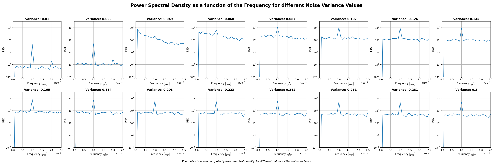
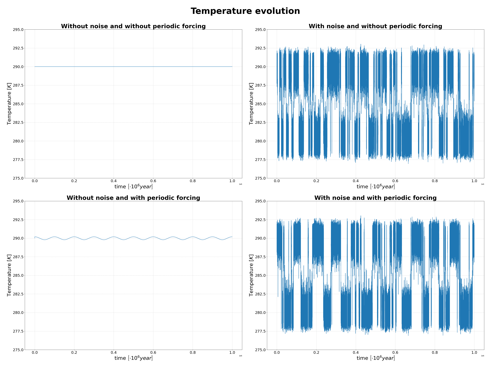

# Stochastic Resonance Simulation for a Climate Model

## General Introduction and Objective of the Repository

Stochastic resonance is a phenomenon observed in nonlinear systems, wherein a weak input signal, like a faint signal, can be enhanced and optimized through the 
presence of noise.
The three basic characteristics are (i) the presence of an energetic activation barrier (or a form of threshold), (ii) a weak coherent input (such as a periodic
signal), and (iii) a source of noise. Given these features, the responce of the system undergoes a resonance-like behaviour as a function of the noise level.

The mechanism of stochastic resonance was first described in the early 1980s by Italian physicists Roberto Benzi, Alfonso Sutera, and Angelo Vulpiani, with the additional participation of Giorgio Parisi[^1]. They applied this concept to climatology with the aim of explaining how small variations in Earth's motions, known as the Milanković cycles, could lead to significant climate variations on Earth. Specifically, they sought to elucidate the transitions between glacial periods, characterized by colder temperatures and extensive ice cover, and interglacial periods, marked by warmer temperatures and reduced ice cover.

The goal of this repository is to use numerical simulations to investigate the stochastic resonance phenomenon within the context of climate dynamics, the field where it was first introduced.

## Structure of the Project

### Running the Simulation and Plotting Results

To execute the simulation and visualize the results, follow these steps:

1. **Download the Repository:** Begin by downloading the project repository to your local machine. You can do this by using the `git clone` command in your terminal or command prompt: `git clone <repository_url>`

2. **Running the Simulation:** After cloning the repository, execute the simulation by running `simulation.py` from the command line. If you want to use a custom configuration file, specify it as an argument: `python simulation.py [custom_configuration.txt]`. If no configuration file is specified, the default 'configuration.txt' will be used.

This step generates data files and saves them in the *data* folder.

3. **Generating Plots:** After running the simulation, create plots to visualize the results using `plots.py` with the chosen configuration file: `python plots.py [custom_configuration.txt]`. If no configuration file is specified, the default 'configuration.txt' will be used.

The plots are saved in the *images* folder.

5. **Running Tests:** To run tests and ensure the correctness of the project, use `pytest` to execute the testing file `testing.py`. From the command line run `pytest testing.py`. Make sure you have pytest installed in your Python environment.

### Creating a New Configuration File

To create a new configuration file for the simulation, follow these guidelines:

**Note**: The configuration file must be located in the repository folder.

1. **Configuration Sections:**

   The configuration file should have three sections: named *settings*, *data_paths*, and *image_paths*.

2. **settings Section:**

   In the *settings* section, specify the constants and simulation parameters (see the section *Simulation Parameters and Configuration File*).

3. **data_paths Section:**

   In the *data_paths* section of the configuration file, specify the file paths for data storage as follows:

   - *temperatures_for_emission_models_comparison*: Path to store temperature data used for emission models comparison.
   - *emitted_radiation_for_emission_models_comparison*: Path to store emitted radiation data used for emission models comparison.
   - *F_for_emission_models_comparison*: Path to store rate of temperature change used for emission models comparison.
   - *times_for_evolution_towards_steady_states*: Path to store time data for evolution towards steady states.
   - *temperatures_for_evolution_towards_steady_states*: Path to store temperature data for evolution towards steady states.
   - *times*: Path to store time values.
   - *temperatures*: Path to store temperature values.
   - *frequencies*: Path to store frequency data used for power spectra plots.
   - *averaged_PSD*: Path to store averaged power spectral density data.
   - *peak_heights_in_PSD*: Path to store peak heights data in power spectral density.
   - *times_combinations*: Path to store time data for combinations data.
   - *temperatures_combinations*: Path to store temperature data for combinations data.

4. **image_paths Section:**

   In the *image_paths* section of the configuration file, specify paths for storing generated images as follows:

   - *emission_models_comparison_plots*: Path to save plots for emission models comparison.
   - *temperatures_towards_steady_states_plot*: Path to save the plot showing temperature convergence towards stable solutions.
   - *power_spectra_plots*: Path to save power spectra plots.
   - *peak_heights_plot*: Path to save the plot displaying peak heights in power spectral density.
   - *temperature_combinations_plots*: Path to save plots showing temperature evolution for specific noise variance combinations.

Now you can create a custom configuration file by specifying values for these parameters and paths.

To run the simulation with your custom configuration file, as explained in the *Running the Simulation and Plotting Results* section, you should specify it as a command-line argument.

### Project Files

The project consists of the following key files:

- **`configuration.txt`**: The configuration file where simulation parameters and file paths are specified.
- **`stochastic_resonance.py`**: Contains function definitions required for the simulation.
- **`testing.py`**: Contains unit tests for functions in *stochastic_resonance.py*.
- **`simulation.py`**: The main script for running simulations, reading parameters from the configuration file, and saving data to the *data* folder.
- **`plots.py`**: Contains functions for generating plots based on the data generated by *simulation.py*.
- **`aesthetics.py`**: Provides functions for enhancing user interaction, including a progress bar and text formatting.

## The stochastic resonance mechanism in climate change

### Observations of Past Climate and the Milanković Cycles

Over the past 800,000 years, Earth's climate has undergone cyclical shifts between glacial and interglacial periods, occurring approximately every 100,000 years. These climatic cycles follow a characteristic sawtooth pattern, featuring a rapid warming during transitions to interglacial periods, lasting about 10,000 years, followed by a gradual return to glacial conditions. This process leads to an average Earth temperature variation of approximately 10 degrees Celsius. In addition to this primary periodicity, two minor cyclic fluctuations with periods of about 41,000 and 26,000 years have been observed. Collectively, these three cycles are known as the "Milanković cycles," named in honor of the Serbian scientist who, as early as 1941, successfully explained their regularity using Earth's orbital parameters. Specifically, the 100,000-year cycle is associated with variations in Earth's orbital eccentricity (how much the orbit deviates from a perfect circle), the 41,000-year cycle relates to changes in the tilt of Earth's axis, and the 26,000-year cycle is influenced by the precession of the equinoxes.

These variations in orbital parameters, driven by the gravitational influence of other planets in our solar system, are responsible for fluctuations in the average solar radiation reaching our planet. It has been hypothesized that these Milanković cycles may have played a crucial role in initiating and concluding Earth's glacial epochs.

However, when considering the global scale, variations in solar irradiance are relatively limited and cannot, by themselves, account for the observed drastic temperature change of 10 degrees Celsius. Therefore, there is a need to identify an amplification mechanism capable of translating these modest solar variations into significant climatic shifts. This project focuses on the proposal put forth by Italian researchers Benzi, Parisi, Sutera, and Vulpiani in the early 1980s, introducing the concept of stochastic resonance as a potential amplification mechanism.

### The Stochastic Resonance Model: Amplifying the Milanković Cycles

In the work by Benzi, Parisi, Sutera, and Vulpiani, a model for the Earth's temperature evolution over time is introduced. This work is quite extensive and requires time for a detailed explanation. Therefore, in this section, I will provide commentary only on the final result, while referring the derivation to the *Explanation of the Model* section.

The proposed stochastic differential equation (SDE) to describe the evolution of Earth's temperature over time is as follows:

$$
\frac{dT}{dt} = F(T) + \sigma \frac{dW}{dt}
$$

Where:

- $T$ represents Earth's temperature [K].
- $C$ represents the surface thermal capacity of the Earth [J/m² K].
- $F(T)$ is the deterministic part of the equation that accounts for the Milanković cycles and stable and unstable temperature solutions. Stable temperatures are values to which the system converges, such as the average glacial and interglacial temperatures on Earth. The unstable solution is an unobservable solution located midway between these two extremes.
- $W$ is a one-dimensional Wiener process that models the random variability of temperature on much shorter timescales than those considered in the deterministic model.
- $\sigma^2$ [K^2/year] represents the variance of this noise and can be adjusted to study how different levels of variability can affect temperature behavior under various conditions.

In essence, the true innovation of the proposed model is the introduction of the stochastic term in the equation.

This new term allows us to explore how climatic variability, can influence the evolution of Earth's temperature. In particular, researchers have found that for a certain value of the noise variance $\sigma^2$, there is an amplification of the periodic signal in the power spectrum, leading to an amplification of the Milanković Cycles.

The equation can be numerically solved in various ways, but in this project, the Forward Euler method was used, which is explained in more detail below.

#### Forward Euler Discretization

Here's how the forward Euler numerical integration works:

- **Discretization**: The Forward Euler method approximates solutions of differential equations by breaking the continuous-time domain into discrete time steps ($\Delta t$).

- **Iterative Process**: It starts from an initial condition and iteratively updates the system's state at each time step.

- **Temperature Update**:
  - To account for the stochastic temperature variability (from the Wiener process), random numbers following a normal distribution (zero mean, variance equal to $\Delta t$) are generated at each time step.
  - The temperature change $dT$ is then found by adding the deterministic temperature change, $F(T)$, and the stochastic temperature change, $\sigma \cdot W$.
  - The new temperature value $T(t_n)$ is then found by adding to the previuos temperature value $T(t_{n-1})$ che computed temperature change $dT$. 
  - The results is the new temperature value for the next time step.

- **Repeat**: The process repeats for the specified number of time steps, allowing us to simulate temperature evolution over time.

The Forward Euler discretization method allows us to simulate temperature evolution over time, considering both deterministic changes as per the energy balance equation and stochastic fluctuations captured by random numbers from the Wiener process.

### Meaning of the obtained plots and examples

The *images* folder contains 5 different graphs. Below, I will explain how they were obtained and display the results.

1. **emission_models_comparison_plots.png**:

In the *Additional Model Details* section, two different approaches for calculating emitted radiation as a function of temperature are discussed. The first model employs the Stefan-Boltzmann law for a black body, while the second model utilizes a linear approximation (as described in [^4]).
The *emission_models_comparison_plots* graph aims to compare these two models. It consists of two subplots:
- *Emitted radiation comparison*: The first subplot displays the emitted radiation as a function of temperature, computed using both models. This allows us to visually compare how these models estimate radiation emissions across the temperature range of interest. The temperatures considered for this comparison are those relevant to the model, spanning from 10 degrees Kelvin below the first stable temperature to 10 Kelvin above the second stable temperature.
- *Deterministic Term Comparison*:  The second subplot demonstrates the deterministic term of the temperature evolution equation, denoted as $F(T)$, calculated for both models. Similar to the first subplot, this provides a comparative view of how the deterministic terms differ between the two models over the specified temperature range.

2.**temperatures_towards_steady_states_plot.png**:

The graph *temperatures_towards_steady_states_plot.png* illustrates the temperature evolution over time when neither the noise term nor the periodic forcing are considered. It represents the solution to the temperature equation:

$$
\frac{dT}{dt} = F(T)
$$

The graph is generated by plotting the temperature's evolution for various initial temperatures, including the three temperature solutions (two stable and one unstable) and temperatures in their vicinity. It demonstrates that if the temperature is precisely equal to one of these solutions, the system will remain at that temperature throughout. Conversely, if the temperatures deviate from one of these three values, they will tend to converge towards the nearest stable temperature solution and diverge from the unstable one.

3.**power_spectra_plots.png**:

The graph displays various power spectra for different noise intensities. Please note that the vertical axis is presented in a logarithmic scale. 
These graphs were obtained through the following steps:

- For each noise variance value (*you can specify these values in the configuration file, including the minimum variance (variance_start), maximum variance (variance_end), and the number of evenly distributed variance values to analyze within this range (num_variances)*), a specific number of temperature evolution simulations are conducted. To be precise, for each variance value, the number of simulations matches the value specified in the configuration file (*num_simulations*).

- The power spectrum of each simulation (total number is *num_simulations*$\cdot$*num_variances*) is then calculated.

- The power spectra calculated for each noise value in then found by averaging the simulations done for that specific noise value.

The resulting graphs represent the averaged simulations for each noise value. It's worth noting that the peak of interest is located at the frequency of $\frac{1}{p}$, where p is the forcing_period specified in the configuration file. This forcing_period corresponds to the period of the longest Milankovitch cycle ($10^{5}$ years).

4. **peak_heights_plot.png**:

This graph displays the calculated peak height in the power spectrum for each noise intensity.

For each averaged power spectrum shown in the *power_spectra_plots.png* graph, the peak height corresponding to the forcing frequency (inverse of the forcing_period) is computed. This value is then adjusted by subtracting the peak's baseline, which is calculated as an average of nearby values. The graph illustrates how the peak height varies across different noise intensities. The maximum peak height occurs at the variance value corresponding to the phenomenon of stochastic resonance.

5. **temperature_combinations_plots.png**:

This graph illustrates the temperature evolution in four different scenarios:
- When neither periodic forcing nor noise is introduced into the system.
- When the system includes periodic forcing but not noise.
- When the system lacks periodic forcing but includes noise with an intensity corresponding to the occurrence of stochastic resonance.
- When both periodic forcing and noise are present in the system, with the noise intensity matching the level at which stochastic resonance occurs.

# Explanation of the Model

### A Global Energy Balance Model

The fundamental variable in this model is the Earth's average temperature, denoted as *T*. The average is taken over the entire Earth's surface and over a long meteorological time. The value of this variable is determined by the energy balance between incoming and outgoing energy within the system.

The incoming energy is provided by solar radiation, denoted as $R_{in}(T)$, while the outgoing energy $R_{out}(T)$ consists of two components: the radiation emitted by Earth, $\epsilon (T)$, and the fraction of incoming radiation directly reflected by the Earth's surface, $\alpha(T)R_{in}(T)$. For simplicity, this model disregards the contribution of the atmosphere.

In mathematical terms:

$$
C \frac{dT}{dt} = R_{in}(T) - R_{out}(T)
$$

Here, $C$ represents the thermal capacity of Earth [J/m² K]. The incoming radiation can be modeled as:

$$
R_{in}(T) = Q\mu (t)
$$

Where $Q$ is a long-term average of incoming solar radiation, and the dimensionless parameter $\mu(t)$ accounts for the small periodic variation in $Q$ caused by changes in Earth's orbital eccentricity (with a period of 100,000 years).

The outgoing radiation can be described as:

$$
R_{out}(T) = \alpha(T)R_{in}(T) + \epsilon(T)
$$

Here, $\alpha(T)$ represents the global average albedo, which is the fraction of incoming radiation directly reflected by Earth's surface; while $\epsilon(T)$ denotes the infrared radiation emitted by Earth. This emitted radiation can be modeled using either Stefan-Boltzmann's law for a blackbody or a linear approximation.

Neglecting the role of albedo and the periodic modulation of incoming radiation, the system has a stable solution where $\frac{dT}{dt} = 0$, resulting in $Q = \epsilon(T)$. The temperature solution, denoted as $T^*$, is a mathematical fixed point. In other words, the system self-regulates to attain this temperature.

However, albedo is not constant; it varies between 0 and 1 and depends on Earth's temperature, mainly influenced by factors like ice cover and cloudiness. Both these factors contribute to an increase in the reflected radiation, i.e., an increase in albedo.

The temperature dependence of albedo introduces feedback mechanisms in the system, leading to multiple fixed points at different temperatures. Within the temperature range of interest, feedback from ice and clouds results in the presence of two stable fixed points ($T_1$ and $T_3$) and an unstable fixed point ($T_2$).

From a physical standpoint, only the stable fixed points are significant, as the system naturally moves away from an unstable fixed point, making it unobservable. The stable fixed points correspond to Earth's temperatures during glacial and interglacial states, and we assume $T_3-T_1 = 10 K$.

Now, consider the astronomical modulation of incoming radiation. If the incoming radiation were greatly reduced, there would be a single stable fixed point corresponding to the glacial state ($T_1$). Conversely, if incoming radiation were significantly higher, there would be a single fixed point corresponding to the interglacial temperature ($T_3$).

However, as mentioned earlier, the astronomical modulation is very small and alone insufficient to eliminate one of the two stable fixed points. The system maintains both stable fixed points but varies the degree of stability between them. The mechanism that enables the system to transition from one stable fixed point to the other, which is more stable, is stochastic resonance.

### Introducing Meteorological Climate Variability and the Stochastic Resonance Mechanism

Up to this point, our model has overlooked the meteorological variability of the climate, which includes temperature fluctuations around the equilibrium temperature due to various factors. This temperature variability occurs on a much shorter timescale compared to what we have considered so far and can be viewed as a "fast" variable. We can treat this variability as noise directly affecting the slower variables.

The dynamics of the fast process need not be resolved in detail; instead, we can focus on its statistical properties. Moreover, the statistics of fast variables can be assumed to follow a Gaussian distribution since, when averaged over the timescale of slow processes, they result from many independent causes. This fast process can be modeled using a one-dimensional Wiener process.

A one-dimensional Wiener process, also known as Brownian motion, is characterized by:

- A continuous and random trajectory over time. Continuity means that the mapping $t \rightarrow W(t)$ is continuous.
- Independent increments between successive time points. In other words, given time points $0 = t_1 < t_2 < ... < t_N = T$, the increments $W(t_N) - W(t_{N-1}), ..., W(t_1) - W(t_0)$ are independent.
- Increments follow a normal (Gaussian) distribution with zero mean and variance proportional to the time interval. In mathematical terms, for $\Delta W = W(t) - W(s)$, we have $E[\Delta W] = 0$ and $V[\Delta W] = t - s$.

We can now revisit the previous energy balance equation and introduce a new term to model temperature variability. In this equation, denoting $F(T) = \frac{1}{C}(R_{in}(T) - R_{out}(T))$, we introduce the new term:

$$
\frac{dT}{dt} = F(T) + \sigma \frac{dW}{dt}
$$

Here, $\sigma^2 [K^2/year]$ represents the noise variance, and $W(t)$ is the standard Wiener process. This last equation is a stochastic differential equation (SDE) describing the evolution of temperature in our model.

It can be solved numerically using various procedures. In this project, the Forward Euler method was employed to simulate the temperature's evolution.

### Parametrization of the Deterministic Rate of Temperature Change

An important step in constructing the model is the parametrization of $F(T)$. The derivation of this function is detailed in the article by Benzi et al. [^2], which is a complex process that goes beyond the scope of this repository. For a comprehensive understanding of the derivation, please refer to the aforementioned article or the review [^3] listed in the *References* section.

The final result for $F(T)$ is given by the equation:

$$
F(T) = \frac{\epsilon(T)}{C} \left( \frac{\mu(t)}{1 + \beta \left(1 - \frac{T}{T_1}\right)\left(1 - \frac{T}{T_2}\right)\left(1 - \frac{T}{T_3}\right)} - 1 \right)
$$

Here are the key components of the equation:

- $\epsilon(T)$: Represents the infrared radiation emitted by Earth.
- $C$: Denotes the average thermal capacity of Earth.
- $\mu(t)$: An adimensional periodic function used to model variations in incident solar radiation on Earth.
- $T_1$, $T_2$, and $T_3$: Correspond to different temperature values within the Earth's climate system. 
  - $T_1$: The average Earth temperature during the glacial period (stable solution).
  - $T_2$: An unstable temperature of the system (not observable).
  - $T_3$: The average Earth temperature during the interglacial period (stable solution).

The constant $\beta$ can be determined using the following equation:

$$
\beta = -\frac{C}{\tau \epsilon(T_3)}\frac{T_1 T_2 T_3}{(T_1 - T_3)(T_2 - T_3)}
$$

Here, $\tau$ represents the relaxation time of the system.

### Additional Model Details

This section provides further insights into modeling Earth's emitted radiation ( $\epsilon(T)$ ) and the periodic modulation of solar radiation ( $\mu(t)$ ) within the context of the model.

- **Emitted Radiation** ( $\epsilon(T)$ )

The radiation emitted from Earth's surface per unit time and area, denoted as $\epsilon(T)$, has been modeled in two distinct ways:

1. *Stefan-Boltzmann's Law for Blackbody Radiation:* This model employs the fundamental equation of blackbody radiation:

$$
\epsilon(T) = \sigma_{SB} T^{4}
$$

Where, $\sigma_{SB}$ represents the Stefan-Boltzmann constant.

2. *Linear Approximation:* In this approach, $\epsilon(T)$ is linearly approximated to better fit empirical data observed within the range of temperatures of interest (see the article [^4]) :

$$
\epsilon(T) = A + B \cdot T
$$

In this equation, $A = -339.647 W \cdot m^{-2}$ and $B = 2.218 W \cdot m^{-2} K^{-1}$ are parameters estimated based on empirical data [^4].

The function responsible for calculating Earth's emitted radiation, depending on the selected model, is implemented in the *stochastic_resonance.py* module and is named *emitted_radiation*. This function takes as input the *emission_model* parameter, which can take values *linear* or *black body* to specify the chosen model for simulations. It's important to note that the choice between these two models does not significantly impact the final results. A comparison between the two models is available in the *emission_models_comparison_plots.png* graph within the *images* folder. Additionally, to adapt to the extended time scales considered in the analysis, parameters A and B, as well as the Stefan-Boltzmann constant in the black body model, have been converted so that years serve as the unit of time rather than seconds.

- **Periodic Modulation of Solar Radiation** ( $\mu(t)$ )

To model the variation in solar radiation incident on Earth's surface (remembering that $R_{in} = Q \mu(t)$ ) due to changes in Earth's orbital eccentricity, the periodic function $\mu(t)$ was utilized. This function has been parameterized as follows:

$$
\mu(t) = 1 + A \cdot \cos(\omega t)
$$

Here, $\omega$ represents the angular frequency of the oscillation, and $A$ is the amplitude of the oscillation. Since the period of this oscillation corresponds to the longest Milankovitch cycle (refer to the section *Observations of Past Climate and the Milankovitch Cycles*), the angular frequency is defined as $\omega = \frac{2 \pi}{10^{5}}$. Furthermore, the amplitude A is a small parameter, with an estimated value of approximately $A = 0.0005$.

The function responsible for calculating this modulation is implemented in the *stochastic_resonance.py* module and is named *periodic_forcing*.

### Simulation Parameters and Configuration File

The project includes a configuration file named *configuration.txt*, divided into three distinct sections. In the settings section, various simulation parameters are specified. Here, we explain each parameter in detail:

- **stable_temperature_solution_1**: This represents the stable lower temperature solution, denoted as $T_1$ in the model. It corresponds to the average Earth temperature during the glacial era and should be specified in Kelvin. The suggested value in the *configuration.txt* file is 280 K.

- **unstable_temperature_solution**: This parameter represents the unstable temperature solution, denoted as $T_2$ in the model (it is unobserved). It should be specified in Kelvin and, for simplicity, is typically set halfway between the first and second stable solutions. In the *configuration.txt* file, its value is 285 K.

- **stable_temperature_solution_2**: This corresponds to the stable higher temperature solution, denoted as $T_3$ in the model. It represents the average Earth temperature during the interglacial era and should be specified in Kelvin. The suggested value in the *configuration.txt* file is 290 K. Note that the observed temperature difference between the glacial and interglacial epochs is approximately 10K.

- **surface_earth_thermal_capacity**: This parameter signifies the thermal capacity of the Earth's surface per unit area ($C$). It should be specified in J/m²K. The suggested value in the *configuration.txt* file is $0.31 \cdot 10^{9} J/m^2 K$.

- **relaxation_time**: This represents the system's relaxation time in years ($\tau$ in the model). In the *configuration.txt* file, its value is set to 13 years. In the article by Benzi et al. [^2], its value is reported as 8 years.

- **emission_model**: This parameter denotes the model used for simulating Earth's emitted radiation. The possible values are *linear* and *black body*. In the *configuration.txt* file, its value is *linear*.

- **forcing_amplitude**: This is the amplitude $A$ of the periodic modulation of incident solar radiation. Its value in the *configuration.txt* file is 0.0005.

- **forcing_period**: This signifies the period of the periodic modulation of incident solar radiation. Its value corresponds to the longest Milankovitch cycle, which is $10^5$ years, as specified in the *configuration.txt* file.

Additionally, there are some more general parameters related to the simulation of temperature evolution (refer to the section *Forward Euler Discretization*). These include:

- **num_steps**: The number of time steps in the simulation. The value in the *configuration.txt* file is 1,000,000.

- **num_simulations**: The number of simulations to run for each noise intensity level. In the *configuration.txt* file, its value is 10.

- **time_step**: The time step for each simulation in years. In the *configuration.txt* file, its value is 1 year.

Lastly, the temperature evolution is simulated for various noise intensities. The *configuration.txt* file specifies the starting noise variance, ending noise variance, and the number of equispaced variance levels to simulate the temperature evolution.

- **variance_start**: Starting variance for noise intensity. In the *configuration.txt* file, it is set to 0.01 [K^2/year].

- **variance_end**: Ending variance for noise intensity. In the *configuration.txt* file, it is set to 0.3 [K^2/year].

- **num_variances**: Number of variance levels to simulate.

- **seed_value** (optional): The seed value for the random number generator used in the simulation.
If not provided, a random seed value is generated between 0 and 1000000.

## References

[^1]: R. Benzi, A. Sutera, and A. Vulpiani, "The mechanism of stochastic resonance", J. Phys. A 14, L453 (1981).

[^2]: R. Benzi, G. Parisi, A. Sutera, and A. Vulpiani, ["A Theory of Stochastic Resonance in Climatic Change"](https://www.jstor.org/stable/2101326), SIAM Journal on Applied Mathematics, Vol. 43, No. 3 (Jun., 1983).

[^3]: Agnes Olsson, Ebba Jernmark Burrows, ["A Study of Stochastic Resonance in a Climate Model"](http://www.diva-portal.org/smash/get/diva2:1680240/FULLTEXT01.pdf), Degree Project in Technology.

[^4]: Daniel D. B. Koll, Timothy W. Cronin, ["Earth’s outgoing longwave radiation linear due to H2O greenhouse effect"](https://www.pnas.org/doi/10.1073/pnas.1809868115)(2018).

